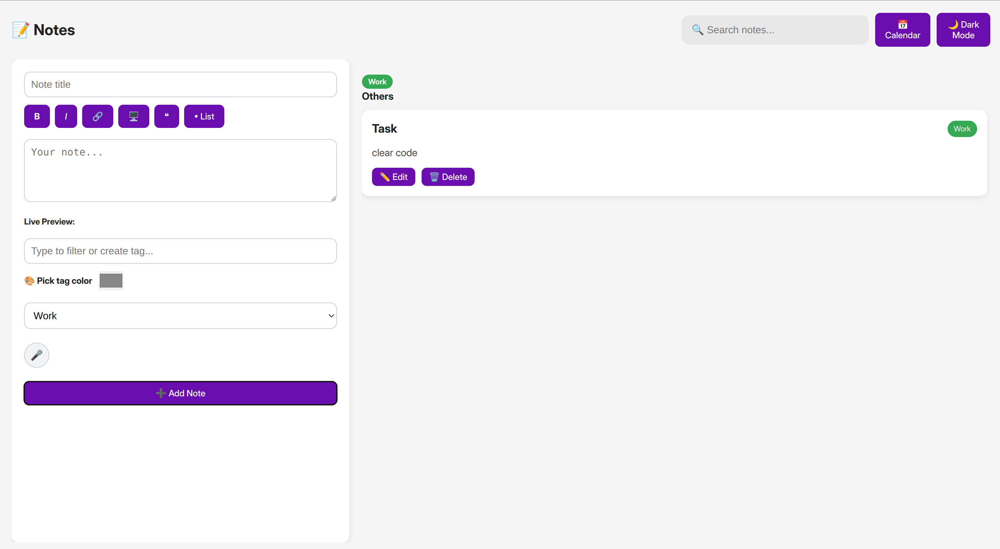

# 📝 Notes App

A beautifully simple, Markdown-powered note-taking app with voice notes, tagging, pinning, and calendar view — built with **React**, styled with care, and deployed on **GitHub Pages**.

[](https://plechareas.github.io/Notes/)

---

## ✨ Features

- 🎨 **Rich Markdown Editing**
- 🔖 **Tagging System** with color-coded labels
- 📌 **Pin/Unpin Notes**
- 🔍 **Search Functionality**
- 📆 **Calendar View** showing note activity
- 🎤 **Voice Notes Recorder**
- 🌙 **Dark/Light Mode Toggle**
- 💾 **Auto-saving in Local Storage**
- 📁 Deployed via **GitHub Pages**

---

## 📸 Screenshots



---

## 🚀 Getting Started

### 1. Clone the Repo

```bash
git clone git@github.com:Plechareas/Notes.git
cd Notes
